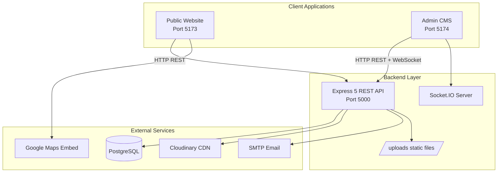
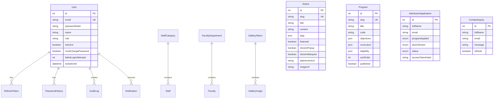
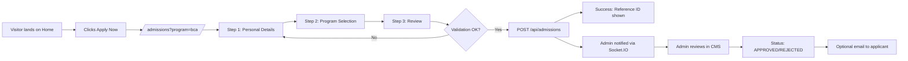
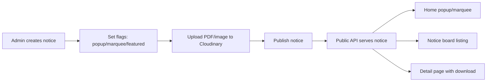
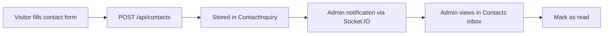

# Product Requirements Document (PRD)
## Itahari Namuna College — Digital Platform

| Field | Value |
|-------|-------|
| **Product Name** | Itahari Namuna College Website & Admin CMS |
| **Version** | 1.0 |
| **Document Date** | June 28, 2026 |
| **Status** | As-built (current codebase) + recommended roadmap |
| **Repository** | `Itahari-Namuna-College` (monorepo) |

---

## Table of Contents

1. [Executive Summary](#1-executive-summary)
2. [Product Vision & Goals](#2-product-vision--goals)
3. [Stakeholders & User Personas](#3-stakeholders--user-personas)
4. [Product Scope](#4-product-scope)
5. [System Architecture](#5-system-architecture)
6. [Information Architecture & Routes](#6-information-architecture--routes)
7. [Functional Requirements — Public Website](#7-functional-requirements--public-website)
8. [Functional Requirements — Admin CMS](#8-functional-requirements--admin-cms)
9. [Functional Requirements — Backend API](#9-functional-requirements--backend-api)
10. [Data Model](#10-data-model)
11. [API Specification Summary](#11-api-specification-summary)
12. [User Flows & Journeys](#12-user-flows--journeys)
13. [Design System & UX Standards](#13-design-system--ux-standards)
14. [Third-Party Integrations](#14-third-party-integrations)
15. [Security & Compliance](#15-security--compliance)
16. [Non-Functional Requirements](#16-non-functional-requirements)
17. [Content Management Strategy](#17-content-management-strategy)
18. [Known Gaps & Technical Debt](#18-known-gaps--technical-debt)
19. [Product Roadmap (Recommended)](#19-product-roadmap-recommended)
20. [Success Metrics (KPIs)](#20-success-metrics-kpis)
21. [Deployment & Operations](#21-deployment--operations)
22. [Appendices](#22-appendices)

---

## 1. Executive Summary

**Itahari Namuna College (INC)** is a full-stack digital platform for a Nepali higher-education institution. It consists of three coordinated applications:

| Application | Purpose | Tech |
|-------------|---------|------|
| **Public Website** | Marketing, information, admissions, and content consumption | React 19 + Vite 8 + Tailwind CSS 4 |
| **Admin CMS (`incadmin`)** | Staff dashboard for content management and submission review | React 19 + DaisyUI + ApexCharts |
| **Backend API** | REST API, real-time notifications, PostgreSQL persistence | Express 5 + Prisma 7 + TypeScript |

The platform enables prospective students and visitors to explore academic programs, read notices, browse galleries, submit admission applications, and contact the college. Administrative staff manage CMS content (notices, programs, gallery, faculty, staff) and operational workflows (admissions review, contact inbox) through a secure admin panel with real-time notifications.

**Current maturity:** Core CMS and operational workflows are implemented. Several public sections (blogs, journals, facilities, cells/units, leadership content) remain static/hardcoded and are candidates for future CMS integration.

---

## 2. Product Vision & Goals

### 2.1 Vision Statement

To provide a modern, trustworthy, and accessible digital presence for Itahari Namuna College that supports student recruitment, transparent communication, and efficient internal operations.

### 2.2 Business Goals

| Goal | Description |
|------|-------------|
| **Recruitment** | Convert visitors into applicants through clear program information and a streamlined admission wizard |
| **Communication** | Publish timely notices (exams, holidays, admissions) with featured/popup/marquee visibility |
| **Credibility** | Showcase campus life (gallery), faculty expertise, facilities, and institutional governance (cells/units) |
| **Operational efficiency** | Centralize admission and contact submissions with admin review workflows |
| **Maintainability** | Allow non-technical staff to update dynamic content without code changes |

### 2.3 Product Principles

- **Separation of concerns:** Public marketing site, admin CMS, and API are independently deployable
- **Graceful degradation:** Public site falls back to bundled mock data when API is unavailable (notices, programs)
- **Security-first admin:** JWT auth, account lockout, audit logging, rate limiting
- **Brand consistency:** Shared color palette and typography across public and admin surfaces

---

## 3. Stakeholders & User Personas

### 3.1 Stakeholders

| Stakeholder | Interest |
|-------------|----------|
| **College leadership** | Brand representation, accurate public information |
| **Admissions office** | Receive and process online applications |
| **Academic departments** | Program details, faculty listings |
| **IT/admin staff** | CMS operations, system security |
| **Prospective students & parents** | Program discovery, application submission |
| **General public** | Notices, contact, gallery |

### 3.2 Personas

#### Persona 1: Prospective Student — *Ravi*
- **Age:** 17–22
- **Goal:** Understand programs (BCA, BHM, BSW, +2), check eligibility, apply online
- **Pain points:** Unclear admission deadlines, scattered information
- **Key journeys:** Home → Academic Programs → Apply for Admission

#### Persona 2: Parent / Guardian — *Sunita*
- **Age:** 35–50
- **Goal:** Verify college credibility, contact administration, read official notices
- **Key journeys:** About → Faculty/Staff, Notices, Contact

#### Persona 3: Admin Staff — *Admin User*
- **Role:** CMS operator, admissions reviewer
- **Goal:** Publish notices, manage gallery, review applications, respond to inquiries
- **Key journeys:** Login → Dashboard → Notices/Admissions/Contacts

#### Persona 4: Faculty Member — *Dr. Sharma*
- **Role:** Listed on About page (managed by admin)
- **Goal:** Accurate profile display (designation, department, photo)
- **Indirect use:** Admin updates faculty records via CMS

---

## 4. Product Scope

### 4.1 In Scope (Current Release)

**Public Website**
- Home page with hero carousel, metrics, program highlights, notice popup/marquee
- About page (Leadership, Vision/Mission, Faculty, Staff tabs)
- Academic hub and program detail pages
- Notice board with filtering and detail viewer
- Photo gallery (albums + lightbox)
- Online admission application wizard (3 steps)
- Contact form with Google Maps embed
- Facilities showcase (static)
- Cells & Units (13 committees, static)
- Publications: Blog and Journal (static)

**Admin CMS**
- Authentication and session management
- Dashboard with statistics and charts
- CRUD for: Notices, Programs, Gallery, Faculty, Staff, Categories
- Admissions review workflow with CSV export
- Contact inquiry inbox
- Real-time in-app notifications (Socket.IO)
- User settings (profile, avatar, password, dark mode)

**Backend**
- REST API with PostgreSQL via Prisma
- JWT authentication for admin
- Cloudinary media uploads
- Optional SMTP email notifications
- Socket.IO for admin real-time events

### 4.2 Out of Scope (Current Release)

- Student portal / LMS
- Online fee payment
- Multi-language (i18n) — English only currently
- Public user accounts / OAuth
- Blog/Journal CMS (content is hardcoded)
- Download center (DB model exists, no API/UI)
- Applicant self-service portal (backend supports token access; public UI not built)
- Analytics integration (Google Analytics, etc.)
- CI/CD and containerized deployment configs

---

## 5. System Architecture

### 5.1 High-Level Architecture



### 5.2 Monorepo Structure

```
Itahari-Namuna-College/
├── src/                 # Public website (React)
├── incadmin/            # Admin CMS (React)
├── backend/             # API server (Express + TypeScript)
│   ├── prisma/          # Schema, migrations, seed
│   └── src/modules/     # Feature modules
├── public/              # Static assets (fonts, favicon)
├── package.json         # Public site dependencies
└── .env.example         # Public env template
```

### 5.3 Technology Stack Detail

| Layer | Technologies |
|-------|-------------|
| **Frontend (Public)** | React 19, React Router 7, Vite 8, Tailwind CSS 4, Framer Motion, GSAP, Lenis, Lucide React, react-hot-toast |
| **Frontend (Admin)** | React 19, React Router 7, Vite 8, Tailwind CSS 4, DaisyUI 5, ApexCharts, socket.io-client |
| **Backend** | Node.js, Express 5, TypeScript, Prisma 7, PostgreSQL, Zod 4, JWT, bcrypt, multer, Cloudinary, nodemailer, pdf-lib, Socket.IO 4 |
| **Security middleware** | helmet, cors, express-rate-limit, express-slow-down, sanitize-html |

### 5.4 Feature-Based Code Organization (Public)

```
src/features/
├── general_pages/     # Home, About, Contact
├── academics/         # Program hub & detail
├── admissions/        # Application wizard
├── notices/           # Notice board & viewer
├── gallery/           # Album grid & lightbox
├── facilities/        # Static facilities
├── cells_and_units/   # Static committees
└── publications/      # Static blogs & journals
```

Each feature typically contains:
- `pages/` — Route-level components
- `components/` — Feature UI
- `services/` — API client wrappers
- `data/` — Static fallback data

---

## 6. Information Architecture & Routes

### 6.1 Public Site Navigation

```
Home
├── About
│   ├── Leadership (tab)
│   ├── Vision & Mission (tab)
│   ├── Faculty (tab) — API-driven
│   └── Admin Staff (tab) — API-driven
├── Academics
│   └── /academic/:slug — Program detail
├── Cells & Units
│   └── /cells-and-units/:unitId
├── Notices
│   └── /notices/:id
├── Gallery
│   └── /gallery/:category
├── Facilities
├── Publications
│   ├── Blog
│   └── Journal
├── Admissions (Apply)
└── Contact
```

### 6.2 Public Routes Reference

| Route | Page | Data Source |
|-------|------|-------------|
| `/` | HomePage | API (notices) + static assets |
| `/about` | AboutPage | Mixed (static tabs + API faculty/staff) |
| `/academic` | AcademicHubPage | API (+ JSON fallback) |
| `/academic/:id` | ProgramDetailPage | API (+ JSON fallback) |
| `/cells-and-units` | CellsHubPage | Static JSON |
| `/cells-and-units/:unitId` | UnitDetailPage | Static JSON |
| `/notices` | NoticeBoardPage | API (+ mock fallback) |
| `/notices/:id` | NoticeViewerPage | API (+ mock fallback) |
| `/gallery` | GalleryHubPage | API only |
| `/gallery/:category` | CategoryGridPage | API only |
| `/contact` | ContactPage | API (form submit) |
| `/admissions` | AdmissionWizardPage | API |
| `/facilities` | FacilitiesPage | Static JSON |
| `/publications/blog` | BlogList | Hardcoded |
| `/publications/blog/:id` | BlogDetail | Hardcoded |
| `/publications/journal` | JournalList | Hardcoded |
| `/publications/journal/:id` | JournalDetail | Hardcoded |
| `*` | Redirect → `/` | — |

**Query parameters:** `/admissions?program=bca` pre-selects program in wizard.

### 6.3 Admin Routes Reference

| Route | Page | Auth Required |
|-------|------|---------------|
| `/login` | LoginPage | No |
| `/dashboard` | DashboardPage | Yes |
| `/admissions` | AdmissionsPage | Yes |
| `/contacts` | ContactsPage | Yes |
| `/notices` | NoticesPage | Yes |
| `/programs` | ProgramsPage | Yes |
| `/gallery` | GalleryPage | Yes |
| `/faculty` | FacultyPage | Yes |
| `/staff` | StaffPage | Yes |
| `/categories` | CategoriesPage | Yes |
| `/notifications` | NotificationsPage | Yes |
| `/settings` | SettingsPage | Yes |

---

## 7. Functional Requirements — Public Website

### 7.1 Home Page (`/`)

| ID | Requirement | Priority |
|----|-------------|----------|
| PUB-HOME-01 | Display animated hero carousel with 8 campus images and 3 rotating content slides | Must |
| PUB-HOME-02 | Show institutional metrics cards (students, programs, years, etc.) | Must |
| PUB-HOME-03 | Display "Why Choose Us" section with value propositions | Must |
| PUB-HOME-04 | Show program information teaser with links to `/academic` and `/admissions` | Must |
| PUB-HOME-05 | Fetch notices from API; display scrolling marquee for notices with `showInMarquee` flag | Must |
| PUB-HOME-06 | Show notice popup modal on load for notices with `showInPopup` flag (once per session) | Must |
| PUB-HOME-07 | Use GSAP animations and Lenis smooth scrolling | Should |
| PUB-HOME-08 | Fall back to mock notices if API unavailable | Must |

### 7.2 About Page (`/about`)

| ID | Requirement | Priority |
|----|-------------|----------|
| PUB-ABOUT-01 | Tabbed interface: Leadership, Vision & Mission, Faculty, Admin Staff | Must |
| PUB-ABOUT-02 | Leadership and Vision/Mission content rendered from static JSX | Must |
| PUB-ABOUT-03 | Faculty tab: fetch from `GET /faculty`, group by department | Must |
| PUB-ABOUT-04 | Staff tab: fetch from `GET /staff`, group by category | Must |
| PUB-ABOUT-05 | Display faculty/staff photos, designations, HOD badges | Must |

### 7.3 Academic Programs

| ID | Requirement | Priority |
|----|-------------|----------|
| PUB-ACAD-01 | List all published programs on `/academic` | Must |
| PUB-ACAD-02 | Program cards show title, code, duration, tagline, cover image | Must |
| PUB-ACAD-03 | Program detail page shows overview, objectives, career pathways, eligibility, highlights | Must |
| PUB-ACAD-04 | Curriculum displayed via syllabus accordion component | Must |
| PUB-ACAD-05 | Requirements checklist component for eligibility criteria | Should |
| PUB-ACAD-06 | "Apply Now" CTA links to `/admissions?program={slug}` | Must |
| PUB-ACAD-07 | Fall back to `courseMatrix.json` if API unavailable | Must |

**Supported programs:** +2 (Science, Management, Humanities, Education streams), BCA, BHM, BSW

### 7.4 Notice Board

| ID | Requirement | Priority |
|----|-------------|----------|
| PUB-NOTICE-01 | List notices with search and category/tag filter tabs | Must |
| PUB-NOTICE-02 | Notice cards show title, summary, date, category, tags | Must |
| PUB-NOTICE-03 | Detail page shows full content, author, published date | Must |
| PUB-NOTICE-04 | Support PDF/image attachment download when available | Must |
| PUB-NOTICE-05 | React Router loader prefetches notice data | Should |
| PUB-NOTICE-06 | Fall back to `mockNotices.js` on API failure | Must |

### 7.5 Gallery

| ID | Requirement | Priority |
|----|-------------|----------|
| PUB-GAL-01 | Display album grid on `/gallery` from API | Must |
| PUB-GAL-02 | Album detail page shows photo grid with captions | Must |
| PUB-GAL-03 | Lightbox modal for full-size image viewing | Must |
| PUB-GAL-04 | Show loading and error states (no mock fallback) | Must |

### 7.6 Admission Application Wizard

| ID | Requirement | Priority |
|----|-------------|----------|
| PUB-ADM-01 | 3-step wizard: Personal Details → Program Selection → Review & Submit | Must |
| PUB-ADM-02 | Personal fields: full name, email, gender, phone, address | Must |
| PUB-ADM-03 | Program selection: PLUS2 (with stream), BCA, BHM, BSW | Must |
| PUB-ADM-04 | +2 applicants must select stream (Science/Management/Humanities/Education) | Must |
| PUB-ADM-05 | Client-side validation on each step before proceeding | Must |
| PUB-ADM-06 | Honeypot field (`website`) for spam bot detection | Must |
| PUB-ADM-07 | Submit via `POST /api/admissions` | Must |
| PUB-ADM-08 | Success screen shows reference ID (application ID) | Must |
| PUB-ADM-09 | Pre-fill program from URL query `?program=` | Should |
| PUB-ADM-10 | Display toast notifications for errors | Must |

**Note:** Backend returns an applicant access token for self-service; public UI does not yet display or use it.

### 7.7 Contact Page

| ID | Requirement | Priority |
|----|-------------|----------|
| PUB-CONTACT-01 | Embedded Google Maps iframe showing college location | Must |
| PUB-CONTACT-02 | Contact form: name, email, phone, department, subject, message | Must |
| PUB-CONTACT-03 | Submit via `POST /api/contacts` | Must |
| PUB-CONTACT-04 | Display hardcoded address, phone, email, office hours | Must |
| PUB-CONTACT-05 | Toast feedback on success/error | Must |

### 7.8 Facilities Page

| ID | Requirement | Priority |
|----|-------------|----------|
| PUB-FAC-01 | Display facilities from static `facilitiesData.js` | Must |
| PUB-FAC-02 | Category filter tabs (Science, Computing, Amenities, etc.) | Must |
| PUB-FAC-03 | Each facility shows image, title, description | Must |

### 7.9 Cells & Units

| ID | Requirement | Priority |
|----|-------------|----------|
| PUB-CELL-01 | Hub page lists 13 college committees/cells | Must |
| PUB-CELL-02 | Detail page shows objectives, duties, action plan per unit | Must |

**Units included:** CMC, IQAC, SAT, RMC, EMIS, FPSM, SQC, ECEASC, SCPSC, LMSC, SRWSC, IDMSC, SAESSC

### 7.10 Publications (Blog & Journal)

| ID | Requirement | Priority |
|----|-------------|----------|
| PUB-PUB-01 | Blog list and detail pages with hardcoded content | Must |
| PUB-PUB-02 | Journal list and detail pages with hardcoded content | Must |
| PUB-PUB-03 | Navbar dropdown for Blog/Journal navigation | Must |

### 7.11 Global Public Components

| ID | Requirement | Priority |
|----|-------------|----------|
| PUB-GLOBAL-01 | Sticky Navbar with responsive mobile menu | Must |
| PUB-GLOBAL-02 | Footer with links, contact info, social placeholders | Must |
| PUB-GLOBAL-03 | PageBanner component on inner pages | Must |
| PUB-GLOBAL-04 | ScrollToTop on route change | Must |
| PUB-GLOBAL-05 | Lazy-loaded routes for code splitting | Should |
| PUB-GLOBAL-06 | Global toast provider (react-hot-toast) | Must |
| PUB-GLOBAL-07 | Smooth scroll via Lenis provider | Should |

---

## 8. Functional Requirements — Admin CMS

### 8.1 Authentication

| ID | Requirement | Priority |
|----|-------------|----------|
| ADM-AUTH-01 | Login with email + password via `POST /api/auth/login` | Must |
| ADM-AUTH-02 | Store access + refresh tokens in localStorage | Must |
| ADM-AUTH-03 | Auto-refresh access token on 401 responses | Must |
| ADM-AUTH-04 | Protected routes redirect unauthenticated users to `/login` | Must |
| ADM-AUTH-05 | Force password change when `mustChangePassword` flag set | Must |
| ADM-AUTH-06 | Logout revokes refresh token | Must |

### 8.2 Dashboard

| ID | Requirement | Priority |
|----|-------------|----------|
| ADM-DASH-01 | Display aggregate stats: notices, programs, admissions, contacts, gallery | Must |
| ADM-DASH-02 | ApexCharts visualizations (admission trends, status breakdown) | Should |
| ADM-DASH-03 | Recent activity feed | Should |

### 8.3 Notice Management

| ID | Requirement | Priority |
|----|-------------|----------|
| ADM-NOTICE-01 | Full CRUD for notices | Must |
| ADM-NOTICE-02 | Fields: title, slug, content, summary, category, tags, audience, author | Must |
| ADM-NOTICE-03 | Toggle flags: published, featured, showInPopup, showInMarquee | Must |
| ADM-NOTICE-04 | Upload PDF attachment and hero image via Cloudinary | Must |
| ADM-NOTICE-05 | Remove uploaded attachments | Must |
| ADM-NOTICE-06 | Paginated data table with search/filter | Must |

### 8.4 Program Management

| ID | Requirement | Priority |
|----|-------------|----------|
| ADM-PROG-01 | Full CRUD for academic programs | Must |
| ADM-PROG-02 | Rich JSON fields: objectives, careerPathways, eligibility, highlights, curriculum | Must |
| ADM-PROG-03 | Upload cover image via Cloudinary | Must |
| ADM-PROG-04 | Upload semester syllabus PDFs | Must |
| ADM-PROG-05 | Reorder programs via sortOrder | Must |
| ADM-PROG-06 | Publish/unpublish toggle | Must |

### 8.5 Gallery Management

| ID | Requirement | Priority |
|----|-------------|----------|
| ADM-GAL-01 | CRUD for gallery albums | Must |
| ADM-GAL-02 | Upload cover image per album | Must |
| ADM-GAL-03 | Multi-image upload to album | Must |
| ADM-GAL-04 | Edit captions, reorder images | Must |
| ADM-GAL-05 | Delete individual images | Must |
| ADM-GAL-06 | Featured album toggle | Must |

### 8.6 Faculty & Staff Management

| ID | Requirement | Priority |
|----|-------------|----------|
| ADM-FAC-01 | CRUD for faculty members with department assignment | Must |
| ADM-FAC-02 | Upload faculty photo (local `/uploads`) | Must |
| ADM-FAC-03 | HOD designation flag | Must |
| ADM-STAFF-01 | CRUD for admin staff with category assignment | Must |
| ADM-STAFF-02 | Upload staff photo (local `/uploads`) | Must |
| ADM-CAT-01 | CRUD for staff categories and faculty departments | Must |

### 8.7 Admissions Review

| ID | Requirement | Priority |
|----|-------------|----------|
| ADM-ADM-01 | List all admission applications with pagination | Must |
| ADM-ADM-02 | Filter by status, program, date range | Must |
| ADM-ADM-03 | View application detail (all submitted fields) | Must |
| ADM-ADM-04 | Update status: PENDING → UNDER_REVIEW → APPROVED / REJECTED | Must |
| ADM-ADM-05 | Add admin notes to application | Must |
| ADM-ADM-06 | Export applications to CSV | Must |
| ADM-ADM-07 | Trigger email notification on status change (if SMTP configured) | Should |

### 8.8 Contact Inbox

| ID | Requirement | Priority |
|----|-------------|----------|
| ADM-CONTACT-01 | List contact inquiries with read/unread status | Must |
| ADM-CONTACT-02 | View inquiry detail | Must |
| ADM-CONTACT-03 | Mark inquiry as read | Must |

### 8.9 Notifications

| ID | Requirement | Priority |
|----|-------------|----------|
| ADM-NOTIF-01 | Real-time notifications via Socket.IO on new admission/contact | Must |
| ADM-NOTIF-02 | Notification center page with read/unread filter | Must |
| ADM-NOTIF-03 | Unread count badge in navbar | Must |
| ADM-NOTIF-04 | Mark individual notifications as read | Must |
| ADM-NOTIF-05 | Delete notifications | Should |

### 8.10 Settings

| ID | Requirement | Priority |
|----|-------------|----------|
| ADM-SET-01 | Update profile (name, email) | Must |
| ADM-SET-02 | Upload avatar (local storage) | Must |
| ADM-SET-03 | Change password (forces re-login) | Must |
| ADM-SET-04 | Dark/light theme toggle (persisted) | Should |

### 8.11 Admin UI Patterns

| ID | Requirement | Priority |
|----|-------------|----------|
| ADM-UI-01 | Sidebar navigation with active route highlighting | Must |
| ADM-UI-02 | Reusable DataTable with pagination, sorting, filters | Must |
| ADM-UI-03 | Modal-based create/edit forms | Must |
| ADM-UI-04 | StatusBadge component for admission statuses | Must |
| ADM-UI-05 | Skeleton loading states | Should |
| ADM-UI-06 | DaisyUI component theming with brand colors | Must |

---

## 9. Functional Requirements — Backend API

### 9.1 Core API Behavior

| ID | Requirement | Priority |
|----|-------------|----------|
| API-CORE-01 | All responses use envelope: `{ success, data, message?, meta? }` | Must |
| API-CORE-02 | Health check endpoint: `GET /api/health` | Must |
| API-CORE-03 | Input validation via Zod schemas | Must |
| API-CORE-04 | HTML sanitization on user-generated content | Must |
| API-CORE-05 | Rate limiting on auth and public POST endpoints | Must |
| API-CORE-06 | CORS configured for public + admin origins | Must |
| API-CORE-07 | Serve local uploads at `/uploads/*` | Must |

### 9.2 Media Processing

| ID | Requirement | Priority |
|----|-------------|----------|
| API-MEDIA-01 | Cloudinary upload for gallery, notices, program media | Must |
| API-MEDIA-02 | WebP compression with configurable quality/width | Must |
| API-MEDIA-03 | PDF compression via pdf-lib before Cloudinary upload | Should |
| API-MEDIA-04 | Multer local upload for faculty/staff photos and avatars | Must |
| API-MEDIA-05 | Configurable max upload size (default 10MB) | Must |

### 9.3 Email Service

| ID | Requirement | Priority |
|----|-------------|----------|
| API-EMAIL-01 | Optional SMTP via nodemailer | Should |
| API-EMAIL-02 | Skip email silently if SMTP not configured | Must |
| API-EMAIL-03 | Send admission status update emails | Should |

### 9.4 Real-Time (Socket.IO)

| ID | Requirement | Priority |
|----|-------------|----------|
| API-SIO-01 | JWT-authenticated Socket.IO connections (admin only) | Must |
| API-SIO-02 | Join user-specific room `admin:{userId}` | Must |
| API-SIO-03 | Emit events on new admission and contact submissions | Must |

---

## 10. Data Model

### 10.1 Entity Relationship Overview



### 10.2 Enums

| Enum | Values |
|------|--------|
| `AdmissionProgram` | PLUS2, BCA, BHM, BSW |
| `Plus2Stream` | SCIENCE, MANAGEMENT, HUMANITIES, EDUCATION |
| `AdmissionStatus` | PENDING, UNDER_REVIEW, APPROVED, REJECTED |
| `NotificationType` | ADMISSION_NEW, CONTACT_NEW, ADMISSION_STATUS, SYSTEM |

### 10.3 Models Not Yet Exposed via API

| Model | Status |
|-------|--------|
| `Download` | Schema exists; no routes or admin UI |

---

## 11. API Specification Summary

### 11.1 Public Endpoints

| Method | Endpoint | Description |
|--------|----------|-------------|
| GET | `/api/health` | Health check |
| GET | `/api/notices` | List published notices |
| GET | `/api/notices/featured` | Featured notices |
| GET | `/api/notices/:id` | Notice by ID or slug |
| GET | `/api/programs` | List published programs |
| GET | `/api/programs/:slug` | Program detail |
| GET | `/api/gallery` | List albums |
| GET | `/api/gallery/featured` | Featured albums |
| GET | `/api/gallery/:slug` | Album with images |
| GET | `/api/faculty` | List faculty |
| GET | `/api/faculty/:id` | Faculty detail |
| GET | `/api/staff` | List staff |
| GET | `/api/staff/:id` | Staff detail |
| GET | `/api/categories/staff-categories` | Staff categories |
| GET | `/api/categories/faculty-departments` | Faculty departments |
| POST | `/api/admissions` | Submit application |
| GET | `/api/admissions/:id` | View application (requires token) |
| PATCH | `/api/admissions/:id` | Update application (requires token) |
| POST | `/api/contacts` | Submit contact inquiry |

### 11.2 Auth Endpoints

| Method | Endpoint | Auth | Description |
|--------|----------|------|-------------|
| POST | `/api/auth/login` | Public | Admin login |
| POST | `/api/auth/refresh` | Public | Refresh tokens |
| POST | `/api/auth/logout` | Public | Revoke session |
| GET | `/api/auth/me` | Admin | Current user |
| PATCH | `/api/auth/profile` | Admin | Update profile |
| POST | `/api/auth/avatar` | Admin | Upload avatar |
| POST | `/api/auth/change-password` | Admin | Change password |

### 11.3 Admin Endpoints (all require JWT + admin role)

| Module | Operations |
|--------|------------|
| `/api/admin/notices` | CRUD, upload/remove PDF & image |
| `/api/admin/programs` | CRUD, reorder, cover image, syllabus PDF |
| `/api/admin/gallery` | Album CRUD, cover upload, multi-image, reorder, caption |
| `/api/admin/faculty` | CRUD with photo upload |
| `/api/admin/staff` | CRUD with photo upload |
| `/api/admin/categories` | Staff categories + faculty departments CRUD |
| `/api/admin/admissions` | List, get, status update, CSV export |
| `/api/admin/contacts` | List, mark read |
| `/api/admin/notifications` | List, unread count, mark read, delete |

---

## 12. User Flows & Journeys

### 12.1 Admission Application Flow



### 12.2 Notice Publication Flow



### 12.3 Contact Inquiry Flow



---

## 13. Design System & UX Standards

### 13.1 Brand Palette

| Token | Hex | Usage |
|-------|-----|-------|
| `--color-brand-primary` | `#045d30` | Primary green — buttons, headers, accents |
| `--color-brand-blue` | `#3db2e1` | Sky blue accents |
| `--color-brand-gold` | `#f2b843` | Highlights, badges |
| `--color-brand-crimson` | `#c22368` | Alert/emphasis |
| `--color-brand-orange` | `#e17622` | CTAs, warm accents |
| `--color-brand-dark` | `#20242b` | Body text, dark surfaces |
| `--color-brand-gray` | `#e7eaef` | Backgrounds |
| `--color-brand-white` | `#fffeff` | Card surfaces |

### 13.2 Typography

| Role | Font | Usage |
|------|------|-------|
| Headings | Plus Jakarta Sans (200–800) | Page titles, section headers |
| Body | Inter (100–900) | Paragraphs, forms, UI text |

### 13.3 Layout

- Border radius: `12px` (`--radius-xl`)
- Max-width content containers on inner pages
- Sticky navbar on public site
- Responsive breakpoints via Tailwind defaults

### 13.4 Animation (Public Site)

- **Lenis:** Smooth scroll globally
- **GSAP:** Home page hero animations
- **Framer Motion:** Carousel transitions, section reveals
- **AnimatedSection / FadeUp / StaggerContainer:** Reusable animation wrappers

### 13.5 Admin Theme

- DaisyUI components with custom brand CSS variables
- Dark mode via `.dark` class on `<html>` (ThemeContext)
- ApexCharts themed via `chartTheme.js`

---

## 14. Third-Party Integrations

| Service | Purpose | Required? | Configuration |
|---------|---------|-------------|---------------|
| **PostgreSQL** | Primary database | Yes | `DATABASE_URL` |
| **Cloudinary** | Image/PDF CDN for gallery, notices, programs | Yes (for media uploads) | `CLOUDINARY_*` env vars |
| **SMTP (Nodemailer)** | Admission status emails | Optional | `SMTP_*` env vars |
| **Google Maps** | Contact page map embed | No (hardcoded iframe) | N/A |
| **Socket.IO** | Real-time admin notifications | Yes (for admin UX) | Built into backend |

**Not integrated:** Payment gateways, OAuth, analytics, SMS.

---

## 15. Security & Compliance

### 15.1 Authentication Security

| Control | Implementation |
|---------|----------------|
| Password hashing | bcrypt (12 rounds, configurable) |
| JWT access token | 15-minute expiry (configurable) |
| JWT refresh token | 7-day expiry, hashed in DB |
| Account lockout | 5 failed attempts → 15-minute lock |
| Password history | Prevents reuse of recent passwords |
| Session limit | Max 3 concurrent refresh tokens per user |
| Forced password change | `mustChangePassword` flag on seed admin |
| Audit logging | All admin actions logged with IP/metadata |

### 15.2 API Security

| Control | Implementation |
|---------|----------------|
| Rate limiting | express-rate-limit on auth and POST endpoints |
| Slow-down | express-slow-down for brute-force mitigation |
| CORS | Configurable origin whitelist |
| Helmet | Security headers |
| Input sanitization | sanitize-html on content fields |
| Validation | Zod schemas on all inputs |
| Honeypot | Admission form bot trap field |

### 15.3 Admission Token Security

- Each application receives a unique access token (hashed in DB)
- Applicant can view/edit via `x-admission-token` header or `?token=` query
- Token not exposed in public success UI (security consideration)

### 15.4 File Upload Security

- Max upload size: 10MB (configurable)
- Cloudinary folder isolation: `inc-college/gallery`
- Local uploads served from `/uploads` with multer validation

---

## 16. Non-Functional Requirements

### 16.1 Performance

| Requirement | Target |
|-------------|--------|
| Public route lazy loading | All major pages code-split |
| Image optimization | Cloudinary WebP compression (75% quality, max 1920px width) |
| API response time | < 500ms for list endpoints (typical) |
| Smooth scroll | Lenis provider without jank |

### 16.2 Reliability

| Requirement | Implementation |
|-------------|----------------|
| API fallback | Mock notices and programs when API down |
| Error handling | Toast notifications + error states |
| Database migrations | Prisma migrations (7 applied) |

### 16.3 Scalability

| Aspect | Current State |
|--------|---------------|
| Architecture | Stateless API (JWT); horizontal scaling possible |
| Media | Offloaded to Cloudinary CDN |
| Real-time | Socket.IO (single-server; Redis adapter needed for multi-instance) |

### 16.4 Maintainability

| Aspect | Implementation |
|--------|----------------|
| Code organization | Feature-based folders (public), module-based (backend) |
| Type safety | TypeScript on backend; JavaScript on frontends |
| ORM | Prisma with generated client |
| Seed data | `backend/prisma/seed.ts` for dev bootstrap |

### 16.5 Accessibility

| Aspect | Current State |
|--------|---------------|
| Semantic HTML | Partial (forms, headings) |
| ARIA | Honeypot uses `aria-hidden` |
| Keyboard navigation | Lightbox, modals need audit |
| **Recommendation:** Full WCAG 2.1 AA audit for production |

### 16.6 Browser Support

- Modern evergreen browsers (Chrome, Firefox, Safari, Edge)
- Responsive design for mobile/tablet/desktop

---

## 17. Content Management Strategy

### 17.1 CMS-Managed Content (Dynamic)

| Content Type | Admin Module | Public Display |
|--------------|--------------|----------------|
| Notices | NoticesPage | Home popup/marquee, Notice board |
| Programs | ProgramsPage | Academic hub & detail |
| Gallery | GalleryPage | Gallery hub & albums |
| Faculty | FacultyPage | About → Faculty tab |
| Staff | StaffPage | About → Admin Staff tab |
| Categories | CategoriesPage | Faculty/staff grouping |

### 17.2 Static Content (Requires Code Change)

| Content Type | Location | Recommendation |
|--------------|----------|----------------|
| Blogs | `publications/blogs/` | Phase 2 CMS |
| Journals | `publications/journals/` | Phase 2 CMS |
| Facilities | `facilities/data/facilitiesData.js` | Phase 2 CMS |
| Cells & Units | `cells_and_units/data/unitaData.js` | Phase 2 CMS |
| Leadership bios | `aboutComponent/LeadershipTab.jsx` | Phase 2 CMS or page builder |
| Vision & Mission | `aboutComponent/VisionMissionTab.jsx` | Phase 2 CMS |
| Home carousel | `HomePage.jsx` + assets | Phase 2 CMS or config |
| Contact info | `ContactPage.jsx` | Site settings module |
| Downloads | DB model only | Phase 2 — build admin + public pages |

### 17.3 Fallback Strategy

| Feature | API Available | API Unavailable |
|---------|---------------|-----------------|
| Notices | Live data | `mockNotices.js` |
| Programs | Live data | `courseMatrix.json` |
| Gallery | Live data | Error state (no fallback) |
| Faculty/Staff | Live data | Empty/error state |

---

## 18. Known Gaps & Technical Debt

| ID | Gap | Impact | Severity |
|----|-----|--------|----------|
| GAP-01 | Applicant self-service portal not built (backend ready) | Applicants cannot track application status online | Medium |
| GAP-02 | Access token not shown on admission success screen | Applicants lose ability to edit application | Medium |
| GAP-03 | Blog/Journal content hardcoded | Content updates require developer | Medium |
| GAP-04 | Facilities & Cells static | Same as above | Low |
| GAP-05 | Download model unused | No public download center | Low |
| GAP-06 | No deployment documentation | Ops risk on go-live | High |
| GAP-07 | No CI/CD pipeline | Manual testing/deployment | Medium |
| GAP-08 | `GalleryContext`, `UIContext` are empty stubs | Dead code | Low |
| GAP-09 | Public `LoginPage.jsx` exists but not routed | Confusing codebase | Low |
| GAP-10 | No i18n (Nepali/English toggle) | Limited local audience reach | Medium |
| GAP-11 | No site-wide search | Poor discoverability | Low |
| GAP-12 | Three separate `npm install` targets | Deployment complexity | Medium |
| GAP-13 | Socket.IO single-server | Breaks with horizontal scaling | Low (until scale) |
| GAP-14 | Inconsistent API fallback (gallery has none) | UX inconsistency when API down | Low |

---

## 19. Product Roadmap (Recommended)

### Phase 1 — Production Readiness (Current → Launch)
- Deployment documentation (nginx, env setup, CORS for production domains)
- Docker Compose for local/staging parity
- CI pipeline (lint, build, test)
- Show admission access token on success screen + applicant status page
- WCAG accessibility audit

### Phase 2 — CMS Expansion
- Publications CMS (blogs & journals)
- Facilities CMS
- Cells & Units CMS
- Download center (admin CRUD + public listing)
- Site settings (contact info, social links, home carousel)

### Phase 3 — Enhanced Experience
- Nepali/English i18n
- Site-wide search
- Google Analytics / privacy-compliant analytics
- SEO metadata management per page
- Applicant portal (full self-service with document uploads)

### Phase 4 — Advanced Operations
- Multi-admin roles (editor vs super-admin)
- Email templates management
- Scheduled notice publishing
- Redis-backed Socket.IO for multi-instance deployment
- Automated database backups

---

## 20. Success Metrics (KPIs)

| Metric | Description | Measurement |
|--------|-------------|-------------|
| **Admission conversion rate** | Visitors → completed applications | Analytics on `/admissions` funnel |
| **Application volume** | Monthly admission submissions | `AdmissionApplication` count |
| **Notice engagement** | Notice detail page views | Analytics |
| **Contact response time** | Time from inquiry to admin mark-read | Admin workflow timestamps |
| **CMS adoption** | Notices/programs updated without dev | Admin audit logs |
| **Site uptime** | API availability | Health check monitoring |
| **Page load time** | LCP on home page | Lighthouse / RUM |
| **Admin notification latency** | Time from submission to Socket.IO event | Backend logging |

---

## 21. Deployment & Operations

### 21.1 Environment Variables

**Public Website (`.env`)**
```
VITE_API_BASE_URL="https://api.namunacollege.edu.np/api"
```

**Backend (`backend/.env`)**
```
DATABASE_URL="postgresql://..."
JWT_ACCESS_SECRET="..."          # min 32 chars
JWT_REFRESH_SECRET="..."         # min 32 chars
PORT=5000
NODE_ENV="production"
CORS_ORIGIN="https://namunacollege.edu.np,https://admin.namunacollege.edu.np"
CLOUDINARY_CLOUD_NAME="..."
CLOUDINARY_API_KEY="..."
CLOUDINARY_API_SECRET="..."
SMTP_* (optional)
SEED_ADMIN_EMAIL / SEED_ADMIN_PASSWORD (initial setup only)
```

**Admin (`incadmin/.env`)**
```
VITE_API_URL="/api"              # or full URL in production
VITE_SOCKET_URL="https://api.namunacollege.edu.np"
VITE_DEV_PROXY_TARGET="http://localhost:5000"  # dev only
```

### 21.2 Build Commands

| App | Install | Dev | Build | Production Start |
|-----|---------|-----|-------|------------------|
| Public | `npm install` | `npm run dev` | `npm run build` | Static hosting (nginx/CDN) |
| Admin | `cd incadmin && npm install` | `npm run dev` | `npm run build` | Static hosting |
| Backend | `cd backend && npm install` | `npm run dev` | `npm run build` | `npm start` |

**Backend setup:**
```bash
cd backend
npm run prisma:generate
npm run prisma:migrate
npm run prisma:seed    # Creates admin user + sample data
```

### 21.3 Recommended Production Topology

```
[CDN/nginx] → Public SPA (static)
[CDN/nginx] → Admin SPA (static, separate subdomain)
[Node.js]   → Backend API + Socket.IO
[PostgreSQL] → Database
[Cloudinary] → Media CDN
[/uploads]   → Persistent volume on API server
```

### 21.4 Ports (Development)

| Service | Port |
|---------|------|
| Public website | 5173 |
| Admin CMS | 5174 |
| Backend API | 5000 |

---

## 22. Appendices

### Appendix A: Cells & Units Reference

| Slug | Full Name |
|------|-----------|
| `cmc` | College Management Committee |
| `iqac` | Internal Quality Assurance Cell |
| `sat` | Self-Assessment Team |
| `rmc` | Research Management Committee |
| `emis` | Education Management Information System |
| `fpsm` | Financial Planning & Strategic Management |
| `sqc` | Student Quality Circle |
| `eceasc` | Extra-Curricular & Extension |
| `scpsc` | Sports & Cultural Program |
| `lmsc` | Library Management |
| `srwsc` | Student Rights & Welfare |
| `idmsc` | Infrastructure Development |
| `saessc` | Student Admission & Examination |

### Appendix B: Academic Programs

| Program | Code | Streams (if +2) |
|---------|------|-----------------|
| Plus Two (+2) | PLUS2 | Science, Management, Humanities, Education |
| Bachelor of Computer Application | BCA | — |
| Bachelor of Hotel Management | BHM | — |
| Bachelor of Social Work | BSW | — |

### Appendix C: Admission Status Workflow

```
PENDING → UNDER_REVIEW → APPROVED
                      → REJECTED
```

### Appendix D: Notification Types

| Type | Trigger |
|------|---------|
| `ADMISSION_NEW` | New admission application submitted |
| `CONTACT_NEW` | New contact inquiry submitted |
| `ADMISSION_STATUS` | Application status changed |
| `SYSTEM` | System-generated messages |

### Appendix E: Seed Admin Credentials (Development)

- Email: `admin@namunacollege.edu.np` (configurable via `SEED_ADMIN_EMAIL`)
- Password: `ChangeMe@123456` (configurable via `SEED_ADMIN_PASSWORD`)
- **Must change password on first login** (`mustChangePassword: true`)

### Appendix F: File Inventory Summary

| Application | Source Files | Language |
|-------------|-------------|----------|
| Public website | ~60+ JSX/JS files in `src/` | JavaScript |
| Admin CMS | ~64 files in `incadmin/src/` | JavaScript |
| Backend | TypeScript modules in `backend/src/` | TypeScript |
| Database | 7 Prisma migrations | SQL |

---

## Document Approval

| Role | Name | Signature | Date |
|------|------|-----------|------|
| Product Owner | _TBD_ | | |
| Technical Lead | _TBD_ | | |
| Stakeholder (College) | _TBD_ | | |

---

*This PRD reflects the as-built state of the Itahari Namuna College codebase as of June 2026, derived from full repository analysis including public website (`src/`), admin CMS (`incadmin/`), backend API (`backend/`), and Prisma schema.*
